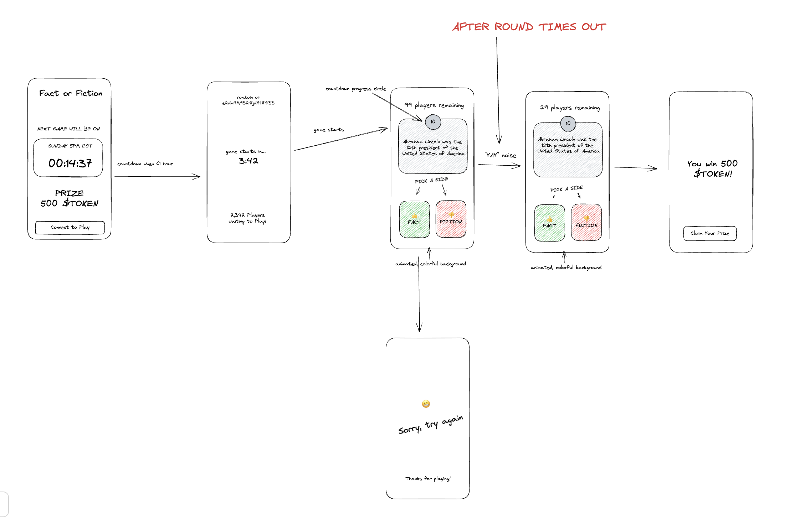

# ARCHITECTING THE USER EXPERIENCE

The main focus of the architectural phase is to develop the user experience (UX) and loosely define how the supporting back end (middleware and smart contracts) functions. Remember that we do not need to discuss implementation details, but we must be able to define the user experience sufficiently enough to develop tasks and assign work responsibilities.

The entire team should be a part of this phase because everyone can provide feedback from their respective ends. Some ideas might be great but remember that you can always come back and iterate and add features during future development.

## THE UX BEHIND FACT OR FICTION

While the user experience for our "Fact or Fiction" game will differ from your idea, we've provided the general UX that we developed during our architectural phase to help you understand how simple we kept it. You should aim to be able to explain your UX in just a few simple steps too.

1. Players enter the website and see a countdown timer to the game start.

2. If they wish to play, they connect their wallet. No $KOIN necessary to play or receive rewards.

3. At the start of the game, they'll see how many players are remaining, the question, 2 buttons stating "fact" or "fiction", and how much time is left to answer.

4. After several rounds, the remaining player is the winner and automatically receives the in-game reward token.

Our written UX is then translated to a spiderweb using excalidraw.

Once the front end UX is generally understood, we can begin to discuss a critical decision process. What data lives on chain vs off chain?

## KEEPING DATA ON CHAIN VS OFF CHAIN

Resources are much more available on Web 2 than on Web 3, so if this is your first time building on blockchain, it might be easier to just throw everything on chain however, you will often find that doing so makes your dApp inefficient and resource dependent.

Consider the following two part question:

**"Do you need to recall data in the future?"** If so,

**"is it critical to your dApps unique value?"**

For the Fact or Fiction game, it was possible to store all types of information on chain, including the questions, score keeping, and all types of metrics however none of these data points improve the UX that we previously described. For that reason, we decide that we would only store the winner's address on chain so we can highlight how data is stored and recovered on chain. In the future, we may use this data to create a historical leaderboard.

## FRONTEND DESIGN

Since the UX is established, it should be easy to build the front end based on the UX. Avoid the pitfall of focusing on the aesthetics. Trust us, the users don't care as much as you think. Instead, focus on an easy experience for the user so they can quickly understand how to navigate your MVP. If you find time at the end of the building stage, you can go back and apply some aesthetics. This module will provide several drop-in components that will help speed up your front-end design.

Our developers were familiar with React, so that's the framework we chose to implement. There are many frameworks you can choose from so use what suits your team.

Our front end interacts with our game server (the middleware) which is connected to the blockchain via a RPC endpoint provided by [koinos.io](https://api.koinos.io)

## BACKEND DESIGN

Each dApp will have a different backend requirement. BurnKoin for example, is entirely powered by the blockchain and contains no backend. Instead, all information is pulled directly from the blockchain. Some dApps might choose to use a serverless design and use Firebase or Supabase.

For Fact or Fiction, we decided on a serverless design to get our MVP shipped as quickly as possible. We will be using supabase to coordinate the front end with the smart contracts.

## SMART CONTRACT DESIGN

Since we previously decided to only store the game winner, we opted for two smart contracts.

**The Gamestats Contract**

This contract is used to store the winning player's address on chain to be recovered in the future. It will receive data from supabase at the end of the game. Storing the game-winner allows us to create a future leaderboard but more importantly, it will demonstrate how to store and recall chain state.

**The Token Contract**

This contract initializes the game reward token and receives mint commands from supabase once the game is completed. The token contract will mint and issue the reward to the address stored in the game state contract.

## KOINOS PRO

Now that we have a general concept of how the application will be structured, we'll need to quickly review how we communicate with the blockchain. Most Web2 developers are already familiar with the function and usage of an API.

Unless a dApp is maintaing their own node, they'll need to use an API service that is maintaining their own node. This is one of the many services provided by Koinos Pro. To sign up visit their website at http://koinos.pro. One of the first things you'll do is create an API key which can be done clicking `Generate API key`.

## NEXT STEPS

The next step is to begin the build phase. By now, you should have developed a basic idea that was sufficient to build a team upon. Together, the team should have developed the idea by working backward with the user outcome to create the user experience. With the UX, the development team should be aware of their work responsibilities and tasks.
